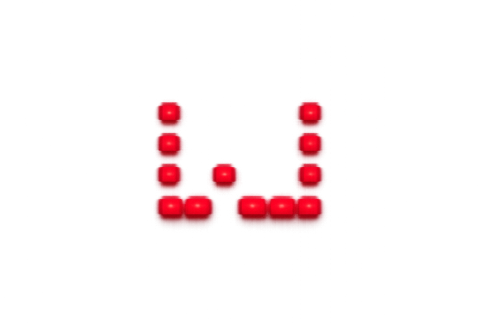

# PolyWollyWin

Custom matrix controller for the **ROG Strix Flare II Animate** keyboard.  
Bypasses Armoury Crate entirely — direct HID control.
<p align="center">
  
</p>
---

## Features

* Direct HID control for the ROG Strix Flare II Animate AniMe Matrix
* No Armoury Crate required
* 37×12 logical matrix renderer with 312 active physical LEDs
* Built-in live effects with adjustable per-effect parameters
* GIF and static image playback with offset, scale, speed, and live preview
* Paint editor with brightness palette, contrast control, fill, invert, and erase tools
* Effect blending with Layer A / Layer B mix control
* Crossfade on mode or effect switch
* Sequencer tab for building timed effect playlists
* System tray controls, quick controls popup, startup option, and close-to-tray behavior
* Optional settings persistence for brightness, contrast, effect speed, GIF path, and last mode

---

## Built-in effects

PolyWollyWin includes:

Pulse, Matrix Rain, Matrix Rain V2, Rain, Wipe, Plasma, Noise, Scan, Starfield, Comet, Ripple, Helix, Fireworks, Bounce, Wave, Snake, Clock, Typing, Audio, Fire, Metaballs, and Game of Life.

Most effects expose live sliders in the Effects tab. Parameter changes apply immediately to the running effect.

---

## Optional dependencies

`sounddevice` is optional. The Audio effect degrades gracefully if no audio device or library is available.

`pynput` is optional. The Typing effect falls back to demo mode if keyboard input capture is unavailable.

`pyinstaller` is only required if you are building the standalone executable.

---

## Build standalone .exe

Using the spec file:

```bash
pyinstaller PolyWollyWin.spec
```

Or manually:

```bash
pyinstaller --noconsole --onefile --name PolyWollyWin --icon assets/pww.ico app.py
```

The `--noconsole` flag suppresses the terminal window on launch.

---

## Build Windows installer

Requires Inno Setup.

```bash
pyinstaller PolyWollyWin.spec
ISCC PolyWollyWin.iss
```

Before building a release, update:

* `version.py`
* `CHANGELOG.md`
* `PolyWollyWin.iss`
* GitHub release tag


---Old readme.md

## Setup

```
pip install -r requirements.txt
python app.py
```

`sounddevice` is optional — the Audio Visualizer effect falls back to a plasma
animation if the library or audio device is unavailable.

---

## Files

| File | Purpose |
|---|---|
| `app.py` | System tray app, control window, main entry point |
| `transport.py` | HID protocol (confirmed from USBPcap) |
| `renderer.py` | GIF/image → 37×12 LED frame conversion |
| `effects.py` | Built-in effects: Pulse, Rain, Wipe, Plasma, Noise, Scan, Audio |
| `paint.py` | 37×12 interactive paint editor widget |

---

## Protocol (confirmed)

Device: VID=0x0B05, PID=0x19FC, usage_page=0xFF02 (MI_04)

```
Packet: 1025 bytes (0x00 report-ID + 1024 payload)

[0x60, 0x81, 0x00, 0x00, <312 LED bytes>, <zero padding>]

LED order: row-major scan of physical LEDs (mask applied)
  Row 0: cols 0-36  (37 LEDs)
  Row 1: cols 2-36  (35 LEDs)
  ...
  Row 11: cols 22-36 (15 LEDs)
  Total: 312 LEDs
```

---

## Build standalone .exe

```
pyinstaller --noconsole --onefile --name PolyWollyWin app.py
```

The `--noconsole` flag suppresses the terminal window on launch.

---

## Adding custom GIFs

1. Open PolyWollyWin → **GIF / Image** tab → Browse…
2. Select any GIF — it auto-fits to the 37×12 display
3. Click **▶ Play**

For precise positioning (matching Armoury Crate fire.json parameters):
edit `auto_fit_gif()` in `renderer.py` or use `GifPlayer` directly with
`offset_x=-49, offset_y=-18, scale=4.1`.

---

## Adding new effects

In `effects.py`, subclass `BaseEffect`:

```python
class MyEffect(BaseEffect):
    name = "My Effect"

    def tick(self, dt: float) -> list[int]:
        frame = np.zeros((ROWS, COLS), dtype=np.uint8)
        # ... fill frame ...
        return self._emit(frame)
```

Then add `MyEffect` to `ALL_EFFECTS`. It will appear in the Effects tab automatically.
